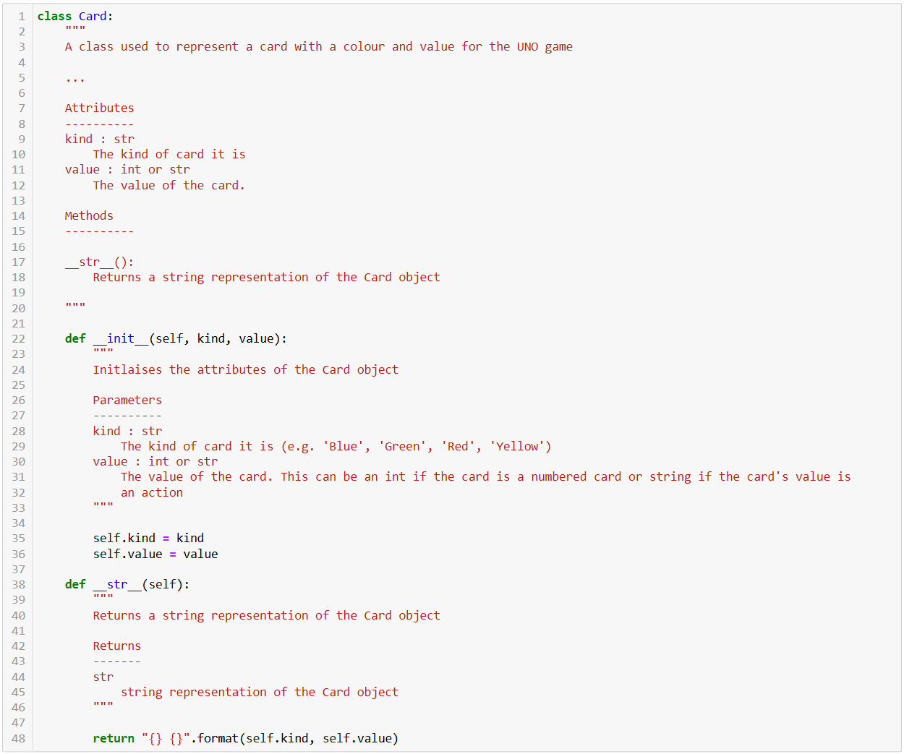

## Creation of the UNO Card Game in Python using OOP

This project implements a fully functional UNO card game for two players using Object-Oriented Programming (OOP) in Python within a Jupyter Notebook. The design emphasizes clean structure, encapsulation, inheritance, and other OOP principles, while simulating the core rules and mechanics of a traditional UNO game. The implementation includes support for house rules, persistent game state saving and robust validation. 

* Created classes for cards, players, deck, and game logic
* Used encapsulation and inheritance where appropriate
* Applied clean coding practices including Consistent naming conventions, DRY principle and comprehensive docstrings and comments throughout
* The logic of all Special Cards (skip turn, take 2, swap direction, wild card, take 4) have been implemented as well as the house rule of swap hands
* Players cannot play invalid Cards and can draw a Card instead of playing
* The Game state is continuously saved to a pickle file in a game session and if the game session were to be exited, the same session can be loaded from the pickle file
* Robust in-notebook testing has been included to demonstrate gameplay functionality

